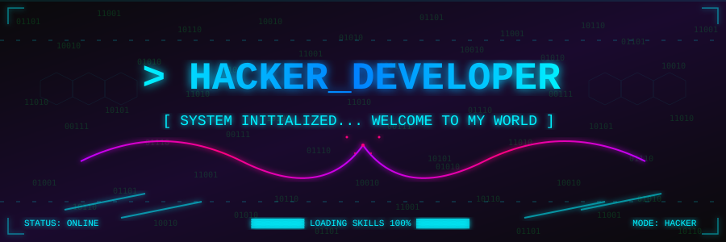
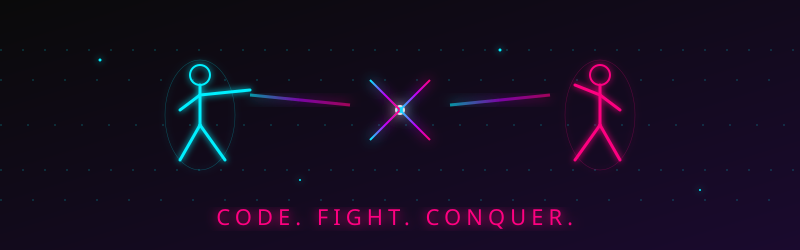

<!--
╔═══════════════════════════════════════════════════════════════╗
║ 🔥 CINEMATIC HACKER GITHUB PROFILE README 🔥 ║
║ Replace yashraj-ghemud with your actual GitHub username ║
╚═══════════════════════════════════════════════════════════════╝
-->

<!-- 🎬 CINEMATIC BANNER -->

<!-- 💥 FIGHTING ANIMATION -->

<!-- ⚡ TYPING ANIMATION - Change the text inside &lines= -->

<!-- 🔥 VISITOR COUNTER & BADGES -->

<!-- 🎯 SECTION DIVIDER -->

<!-- 🖥️ TERMINAL SVG -->

<!-- 👾 ABOUT ME - Hacker Style -->
diff

+ ╔════════════════════════════════════════════════════╗
+ ║              🧠 ABOUT ME - SYSTEM LOG              ║
+ ╚════════════════════════════════════════════════════╝
yaml

name: yashraj-ghemud
alias: "The Ghost Coder"
location: "Somewhere in the Matrix"
current_mode: "HACKER_MODE: ON"
operating_system: "Kali Linux | Windows 11"
editor: "VS Code (with dark hacker theme, obviously)"
languages:
  - JavaScript / TypeScript
  - Python
  - Rust
  - Go
  - C++
  - Bash
frameworks:
  - React / Next.js
  - Node.js
  - Django / FastAPI
  - Docker / Kubernetes
currently_learning:
  - "Quantum Computing"
  - "Advanced Reverse Engineering"
  - "AI/ML Deep Dive"
hobbies:
  - "CTF Challenges 🔥"
  - "Open Source Contribution"
  - "Breaking & Building Systems"
  - "Anime & Manga"
motto: "Code hard or go home. There is no debug button in real life."
<!-- 🎯 SECTION DIVIDER -->

<!-- 📊 GITHUB STATS - Dark Cinematic Theme -->
 GitHub Combat Stats

<!-- 🐍 SNAKE ANIMATION - Contribution Graph -->
 Snake Contribution Graph

<picture>
<source media="(prefers-color-scheme: dark)" srcset="https://raw.githubusercontent.com/yashraj-ghemud/yashraj-ghemud/output/github-snake-dark.svg" />
<source media="(prefers-color-scheme: light)" srcset="https://raw.githubusercontent.com/yashraj-ghemud/yashraj-ghemud/output/github-snake.svg" />

</picture>

<!-- 🎯 SECTION DIVIDER -->

<!-- 🛠️ TECH STACK - Animated Badges -->
 Tech Arsenal

<!-- Languages -->

<!-- Frontend -->

<!-- Backend -->

<!-- DevOps & Tools -->

<!-- 🎯 SECTION DIVIDER -->

<!-- 🎮 ANIMATED ACTIVITY GRAPH -->
 Activity Graph

<!-- 🎯 SECTION DIVIDER -->

<!-- 🏆 Pinned Repos - Hacker Style -->
 Featured Projects

<!-- Replace with your actual repos -->

<!-- 🎯 SECTION DIVIDER -->

<!-- 🤝 CONNECT WITH ME -->
 Connect With Me

<!-- 🔥 FOOTER ANIMATION -->

<!--
╔═══════════════════════════════════════════════════════════════╗
║ 💀 END OF README - Now go deploy this beast! 💀 ║
╚═══════════════════════════════════════════════════════════════╝
-->
